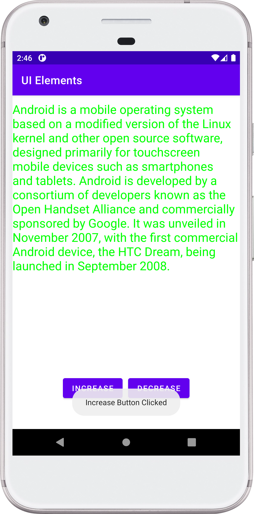
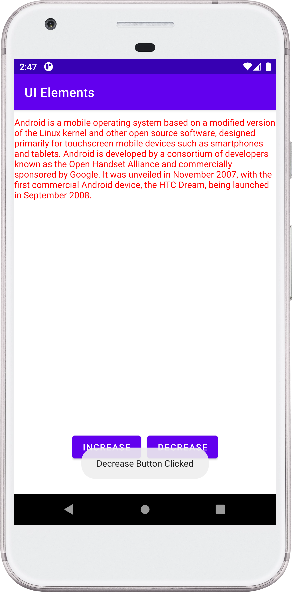

## UIElements - Android Project

### :ski: Steps:
 - Add 1 ScrollView, 1 TextView and 2 button control
 - Paste some text in TextView view control
 - On 'INCREASE' button click --> Increase text size for TextView & change color to green.
 - On 'DECREASE' button click --> Decrese text size for TextView & change color to red.

### Things Learned
 - Adding ScrollView > LinearLayout (orientation: Vertical) > TextView (For paragraph) so that when text size increase a lot and so beyond device boundary, we can scroll and read complete paragraph.
 - Java code adding button OnClickListener   Change text size (increase / decrease) and color change (Green / Red)
 - Adding Toast, which is a text popup. Suppose button increase is click, then toast appear “Increase Button Clicked”

### :camera: Output:

