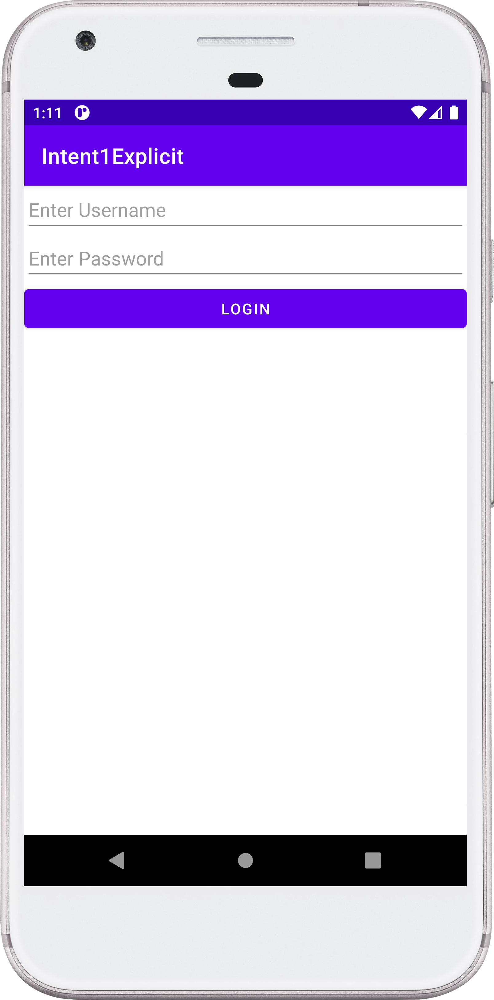

## ExplicitIntent - Android Project

### :ski: Steps:
 - Add 2 EditText View, 1 button control.
 - EditText 1 for Username.
 - EditText 2 for Password.
 - Login button. On button click verify login credential > and pass to another activity.

### :thread: Things Learned
 - Understanding what is intent in android
 - Understanding the working of “Explicit intent” to redirect from one Activity to another inside the same application.

### :camera: Output:

