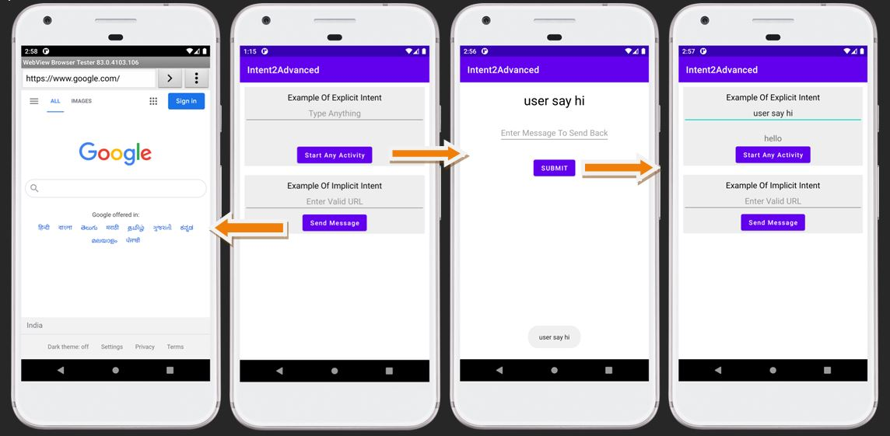

## Advanced Explicit & Implicit Intent - Android Project

### :ski: Steps:
 - Add 2 EditText View, 2 Button control.
 - Button 1 > Call and pass msg to another activity inside the application.
 - Button 2 > Open brower which is explicit to the application and search for the typed text.

### :thread: Things Learned
 - Understanding the Explicit and Implicit intent in android programming
 - Learning how to pass and retrieve message from one Activity to another Activity

### :camera: Output:

