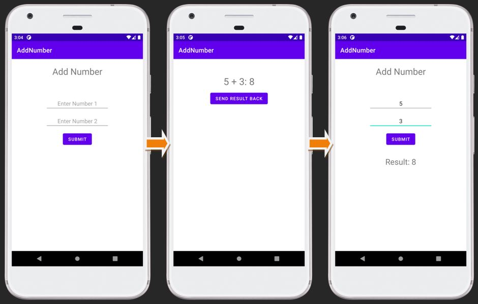

## Add Number - Android Project

Designed Android Project, for displaying the addition of two number such that:
 - Number are submitted from screen 1 (Activity 1).
 - The calculation are perform on screen 2 (Activity 2).
 - And the calculated result is being bring back to Screen 1 (Activity 1).

### :camera: Output:

