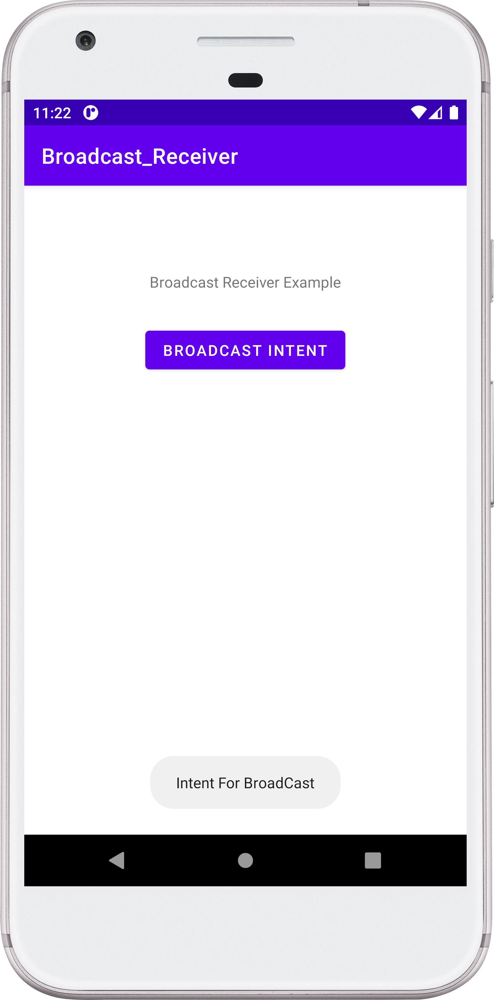

## Menu Option - Android Project

- Understanding the working of Broadcast Receiver.
- NOTE: In new android version after "Oreo", manually registering Broadcast Receiver in AndroidManifest.xml is not necessary, and now we can register BroadCast Receiver Dynamically. 
- In this program the coding is for both, but only Dynamically register Broadcast Receiver will run.

### :camera: Output:

