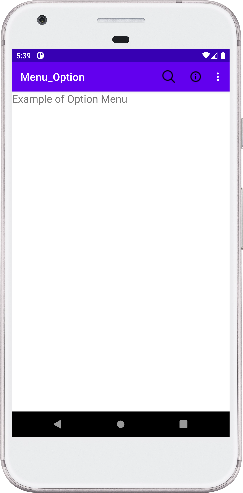

## Menu Option - Android Project

Designed Android Application with Menu Option.

### :thread: Things Learned
 - Working with menu in android.
 - There  are three type of menu in android namely Pop up, Option, and Context.
 - Understanding what is Option menu in android.

### :camera: Output:

