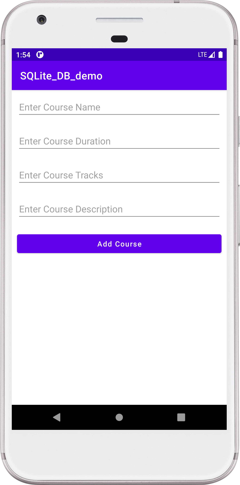

## SQlite Database Demo - Android Project

Designed Android Application, for storing data using SQlite Database.

After successfully running the application and submitting some data into Database. Follow these steps to see and check your data:
 - Go to device file manager
 - Folder > data > data > com.example.projectName > databases > file \[databaseName\].
 - Open the file using DB Browser SQLite.

### :camera: Output:

